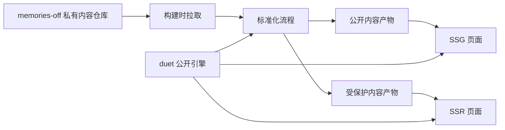

# Duet 架构设计文档

- 日期：2026-03-23
- 状态：Draft
- 适用仓库：`duet`（公开引擎）、`memories-off`（私有内容仓库，待建设）

## 1. 背景

`duet` 当前仍基本保持 `fuwari` 的博客模板结构：内容模型以 `posts` 为中心，页面骨架默认服务于博客列表和文章详情，配置文件也以单站博客心智组织。

本项目的目标不是继续维护一个“更漂亮的博客模板”，而是把它演进为一个“个人数字门户引擎”：

- 博客 `Memories Off (Blog)`：长文内容，继续强调 Markdown、公式、代码高亮和静态性能。
- 动态 `Moments`：短内容流，支持 `public/private` 可见性。
- 主页 `Home`：以门户方式组织个人入口，而不是博客首页套壳。
- `CV`、`Portfolio`：第一阶段仅保留架构占位，不做正式页面设计。

同时，项目必须满足两个核心约束：

- 公开引擎与私有内容严格解耦。
- 私密内容不得以任何形式泄漏到公开静态产物中。

## 2. 核心目标

## 2.1 目标

1. 将 `duet` 设计为可公开开源的渲染引擎，不包含个人敏感数据。
2. 将内容与程序解耦为“双仓库 + 构建时注入”。
3. 支持公开内容静态生成，同时支持私密内容按会话受控渲染。
4. 为 `Blog`、`Moments`、`Home` 提供统一但分域的内容与页面架构。
5. 为未来的 `CV`、`Portfolio` 预留 schema、路由与导航位置，但不提前设计页面。
6. 纠正当前 `fuwari` 基线中不合理的“博客中心型”代码耦合。

## 2.2 非目标

1. 第一阶段不建设数据库或实时后端。
2. 第一阶段不使用运行时远程内容源作为主通路。
3. 第一阶段不做完整多语言内容镜像。
4. 第一阶段不实现 `CV` 与 `Portfolio` 的正式 UI 与交互。
5. 第一阶段不把权限系统扩展为多用户 SaaS。

## 3. 关键决策

| 决策项 | 结论 |
| --- | --- |
| Astro 基线 | 升级到 `Astro 6.0.x` |
| Node 基线 | 升级到 `Node 24` |
| 内容架构 | 双仓库 + build-time fetch + 标准化内容层 |
| 内容接口形态 | 混合型：保留原始 Markdown，同时生成结构化索引与清单 |
| 渲染策略 | 公开内容 `SSG`，私密内容 `SSR` |
| 权限粒度 | 条目级权限控制，`Moments` 为主场景 |
| 鉴权方案 | 第一阶段采用 GitHub OAuth + allowlist |
| 本地开发模式 | 支持示例数据、Token 拉取、本地私仓路径覆盖 |
| `Live Content Collections` | 暂不作为主内容通道 |
| 搜索 / RSS / Sitemap | 私密内容一律排除 |

## 4. 为什么选择 Astro 6 与 Node 24

截至 2026-03-23，Astro 官方已于 2026-03-10 发布 `Astro 6.0`，当前最新版本为 `6.0.3`。Astro 6 的能力与本项目高度契合：

- `Content Layer API` 更适合接入外部内容源和构建时标准化流程。
- `CSP API` 有助于后续引入登录、回调与受保护内容时建立更清晰的安全边界。
- 开发与生产运行时一致性更强，有利于后续引入按需渲染页面。

Astro 6 官方要求 Node `22.12.0` 或更高版本。将项目统一升级到 `Node 24` 的理由如下：

- 统一本地与部署环境的现代 Node 基线，避免再围绕旧 LTS 版本兼容。
- 为 Astro 6 及其依赖升级留出余量。
- 降低后续在 Vite、Zod、适配器与构建工具链上遇到的版本摩擦。

说明：Astro 文档明确给出的是最低支持版本 `22.12.0+`。本设计采用 `Node 24` 是基于“高于最低要求，作为项目统一运行基线”的工程决策。

## 5. 总体架构



本项目拆分为三个层次：

1. 原始内容层：`memories-off`
2. 标准化内容层：由 `duet` 在构建阶段拉取、校验、转换、筛选
3. 渲染层：由 `duet` 输出公开静态页面与受保护动态页面

这里最重要的设计原则是：

- 安全边界不依赖页面组件临时过滤，而依赖标准化产物的显式分层。
- 页面层永远只消费“已经标明公开或受保护性质”的内容。
- `duet` 不直接依赖私有仓库的原始目录细节。

## 6. 双仓库边界

## 6.1 `duet` 的职责

- 定义站点路由、布局系统与组件
- 定义内容 schema 与加载入口
- 执行内容拉取、标准化、脱敏与校验
- 负责搜索、SEO、RSS、Sitemap 等公开索引输出
- 负责登录、会话判断与受保护页面渲染

## 6.2 `memories-off` 的职责

- 存放原始 Markdown 内容
- 存放结构化 YAML 或 JSON 数据
- 存放原始图片、附件与媒体资产
- 存放私密动态、联系方式、简历原始信息等敏感内容

## 6.3 两仓库之间的契约

`duet` 与 `memories-off` 之间不共享组件、脚本或运行时代码，只共享“内容契约”：

- 目录约定
- schema 约定
- 标准化入口约定
- 资产引用规则

这意味着 `memories-off` 可以演化自己的内容组织，但对 `duet` 暴露的是稳定的、标准化后的内容接口。

## 7. 内容组织设计

## 7.1 `memories-off` 推荐目录

```text
memories-off/
  site/
    profile.yml
    home.yml
    nav.yml
  posts/
    2026/
      my-post/
        index.md
        cover.png
  moments/
    2026/
      2026-03-23-001.md
  cv/
    profile.yml
  portfolio/
    prts.yml
    saki.yml
  assets/
    images/
    files/
```

目录按“内容类型”组织，不按“可见性”或“时间”组织。时间、语言、权限都应放入元数据，而不是作为目录边界主导模型。

## 7.2 内容集合

第一阶段建议在 `duet` 中定义以下内容域：

- `site`
- `posts`
- `moments`
- `cv-placeholder`
- `portfolio-placeholder`

其中：

- `site` 为结构化站点数据，不直接暴露原始文件系统形态。
- `posts` 保持 Markdown 驱动。
- `moments` 也使用文件驱动，一条内容一个文件。
- `cv-placeholder`、`portfolio-placeholder` 暂时只保留 schema 与路由占位。

## 7.3 `posts` 与 `moments` 的差异

`posts` 与 `moments` 虽然都可由 Markdown 驱动，但不应共享同一套聚合工具函数和 UI 组件。二者的关注点不同：

- `posts` 强调文章详情、目录、标签、分类、前后篇、SEO、代码与公式渲染。
- `moments` 强调时间流、短内容、私密可见性、可能的富文本片段与轻量媒体。

因此应将二者分为两个独立业务域，而不是继续沿用当前“所有内容都是 posts”的模型。

## 8. 标准化内容层

## 8.1 目标

标准化内容层负责将 `memories-off` 的原始内容转换为 `duet` 可以安全消费的统一内容接口。

其职责包括：

- 拉取私有仓库内容
- 校验目录与 schema
- 解析 Markdown frontmatter
- 生成公开内容清单
- 生成受保护内容清单
- 复制或筛选允许公开发布的资产
- 拒绝不合法或越界的引用

## 8.2 为什么不直接把私有仓库映射到 `src/content`

不建议将 `memories-off` 原样映射到 `src/content`，原因如下：

1. `src/content` 应反映引擎的内容模型，而不是私有仓库的原始组织。
2. 一旦未来需要脱敏、兼容旧内容、生成索引、修正链接，缺少中间层会迅速失控。
3. 安全策略需要在页面渲染前完成，而不是依靠页面组件按字段过滤。

## 8.3 标准化产物

标准化流程至少应产出两类逻辑产物：

- `public manifest`
- `protected manifest`

建议语义如下：

- `public manifest`：只包含可进入静态页面、公开索引、OG、搜索的数据
- `protected manifest`：仅供服务端请求期间读取，不参与静态索引和预构建输出

设计上可以允许这两类产物在磁盘层面临时存在于构建工作目录中，但最终公开产物中不得包含 `protected manifest` 的可枚举内容。

## 8.4 与 Astro Content Layer 的关系

设计上推荐使用 Astro 6 的 Content Layer / loader 能力来承接标准化后的内容入口。

但第一阶段不采用 `Live Content Collections` 作为主内容通道，原因如下：

- 本项目的主目标是“构建时注入 + 可验证的公开/私密边界”，不是“远程内容实时刷新”。
- 运行时获取私有内容会扩大鉴权、失败恢复、缓存与日志泄漏风险。
- 当前场景是个人站，不需要为实时性牺牲可预测性。

## 9. 渲染与路由策略

## 9.1 总体原则

- 公开内容优先 `SSG`
- 私密内容只走 `SSR`
- 相同路径下若存在登录态差异，则该路径整体按 `SSR` 设计

## 9.2 路由矩阵

| 路由 | 方式 | 说明 |
| --- | --- | --- |
| `/` | SSG | 门户首页，仅展示公开摘要 |
| `/posts/[slug]` | SSG | 公开博客详情 |
| `/archive` | SSG | 公开文章归档 |
| `/about` | SSG | 公开静态说明页 |
| `/moments` | SSR | 同一路由内按登录态过滤公开/私密动态 |
| `/auth/*` | SSR | OAuth 回调、登出、会话建立 |
| `/cv` | 占位页 | 第一阶段只保留架构位置 |
| `/portfolio` | 占位页 | 第一阶段只保留架构位置 |
| `/rss.xml` | SSG | 仅公开内容 |
| `/sitemap.xml` | SSG | 仅公开内容 |

## 9.3 关于 Astro 的混合渲染

Astro 5 之后不再使用单独的 `output: "hybrid"` 模式来表达“混合站点”。混合静态与按需渲染应通过默认静态模式配合具体路由的 `prerender = false` 来实现。

因此，本设计在 Astro 6 上的表达应为：

- 公开路由默认预渲染
- 受保护路由显式关闭预渲染

## 10. 鉴权与可见性设计

## 10.1 第一阶段鉴权方案

第一阶段采用：

- GitHub OAuth
- allowlist 白名单，仅允许作者本人账号通过

其优点是实现简单、身份稳定、与个人开发工作流一致。

## 10.2 抽象边界

虽然第一阶段采用 GitHub OAuth，但实现上必须拆出两个独立层次：

- `identity provider`：负责 OAuth 登录与身份获取
- `session / authorization layer`：负责“这个身份是否可以看私密内容”

这样未来即使切换到其他 SaaS 鉴权方案，也不必重写业务判断。

## 10.3 可见性模型

第一阶段建议统一为：

- `public`
- `private`

重点服务于 `Moments`。`posts` 默认公开，若未来确实需要私密文章，再扩展到文章域。

## 10.4 安全红线

以下内容绝不能包含私密条目：

- Pagefind 索引
- RSS
- Sitemap
- Open Graph 描述或图片派生信息
- 静态生成的 JSON / 页面 props / 预取数据

换言之，只要是 `private`，就必须从公开构建链路中彻底剔除。

## 11. 本地开发模式

为保证公开仓库仍可独立开发，建议支持三种内容来源模式：

1. `demo`：使用公开示例内容
2. `token`：通过环境变量拉取私有仓库
3. `local`：直接指向本地 `memories-off` 路径

这三种模式的目标分别是：

- `demo`：保证开源仓库可独立运行
- `token`：模拟 CI / Vercel 构建流程
- `local`：作者日常开发效率最高

## 12. 代码结构重组

当前代码中最主要的问题不是样式，而是职责边界：

- 内容工具默认只有 `posts`
- 主布局默认是博客双栏布局
- 侧栏默认包含博客标签与分类
- 全站配置被揉进单个 `config.ts`

建议重组为：

```text
src/
  app/
    auth/
    config/
    content/
    seo/
    shell/
  domains/
    home/
    blog/
    moments/
    cv/
    portfolio/
  pages/
scripts/
  sync-content/
  normalize-content/
```

设计原则如下：

- `app/` 放跨业务域基础设施
- `domains/` 放每个业务域的 schema、查询、组件、路由装配
- `shell/` 只提供骨架，不内置博客心智
- `blog` 与 `moments` 各自维护自己的内容聚合逻辑

## 13. 视觉与信息架构方向

首页应从“博客列表页”转为“个人门户页”，强调：

- 个人身份入口
- 到 `Blog`、`Moments`、`Projects` 的清晰跳转
- 更克制但更有辨识度的视觉结构

但在代码层面，视觉改造必须建立在新的内容边界和页面骨架之上。否则首页一旦先做，很快会因路由、导航、内容模型变化而返工。

因此设计顺序必须是：

1. 先重构内容入口与布局边界
2. 再重做首页与博客视觉
3. 再引入 `Moments`

## 14. 占位策略

`CV` 与 `Portfolio` 第一阶段不做视觉设计，只做：

- 路由保留
- schema 占位
- 导航配置位
- 页面骨架占位

不建议使用高保真 “Coming Soon” 正式页面，以免制造半成品体验。

## 15. 迁移策略

建议按以下顺序演进：

### Phase 0：升级底座

- 升级到 `Astro 6.0.x`
- 升级到 `Node 24`
- 升级 Astro 官方集成与相关工具链
- 处理 Astro 6 与 Vite 7 迁移项

### Phase 1：内容层重构

- 引入标准化内容层
- 重写内容 schema 与 loader
- 为 `posts`、`moments`、`site` 建立独立域模型

### Phase 2：页面骨架重构

- 拆分当前“博客中心型”主布局
- 将导航、侧栏、Profile、分类标签解耦
- 建立首页专用页面骨架

### Phase 3：功能落地

- 保持 Blog 正常迁移
- 建设 `Moments` SSR 列表页
- 接入登录与私密过滤

### Phase 4：视觉迭代

- 重设计首页视觉
- 调整博客列表与文章详情样式
- 统一门户风格

## 16. 质量门槛与验证要求

这个项目的第一风险不是功能缺失，而是私密内容误进入公开产物。因此最少需要以下验证门槛：

1. schema 校验通过
2. 构建检查通过
3. 公开内容索引不包含私密条目
4. `Moments` 未登录与已登录视图差异符合预期
5. `RSS`、`Sitemap`、搜索索引仅基于公开内容

第一阶段不强制要求完整 E2E，但必须具备“私密内容泄漏检查”的自动化验证。

## 17. 风险与对应策略

| 风险 | 说明 | 对策 |
| --- | --- | --- |
| 继续沿用博客模板心智 | `Moments` 和首页会被硬塞进错误骨架 | 先拆内容域和 shell |
| 私密内容泄漏 | 进入静态索引、预构建数据或搜索产物 | 建立标准化内容层与显式公开/受保护分层 |
| 过早依赖运行时内容 | 增加鉴权和缓存复杂度 | 第一阶段坚持 build-time 注入 |
| 过度依赖平台 Edge 特性 | 本地调试与兼容性复杂 | 先以 Astro SSR/middleware 为主 |
| 一开始就做完整多语或完整 CV/Portfolio | 范围失控 | 只保留占位，不做完整实现 |

## 18. 结论

本项目应被定义为“从 `fuwari` 派生出的个人数字门户引擎重构”，而不是“在博客模板上叠加几个页面”。

推荐采用的正式路线是：

- `Astro 6.0.x`
- `Node 24`
- 双仓库
- build-time fetch
- 标准化内容层
- 公开内容 `SSG`
- 私密内容 `SSR`
- GitHub OAuth + allowlist
- `CV` / `Portfolio` 先占位

后续实现工作必须严格遵守以下优先级：

1. 先建立正确的数据边界与安全边界
2. 再建立页面骨架与领域拆分
3. 最后再进行视觉系统重构

## 19. 参考资料

- Astro 6.0 发布说明：<https://astro.build/blog/astro-6/>
- 升级到 Astro v6：<https://docs.astro.build/en/guides/upgrade-to/v6/>
- Astro Content Collections / Content Layer：<https://docs.astro.build/en/guides/content-collections/>
- Astro Content Loader API：<https://docs.astro.build/en/reference/content-loader-reference/>
- Astro Middleware：<https://docs.astro.build/en/guides/middleware/>
- Astro On-demand Rendering：<https://docs.astro.build/en/guides/on-demand-rendering/>
- Vercel Edge Middleware：<https://vercel.com/docs/functions/edge-middleware>
